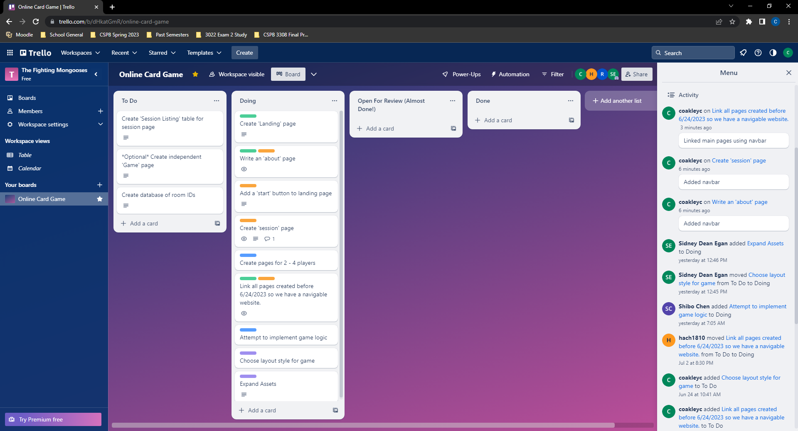
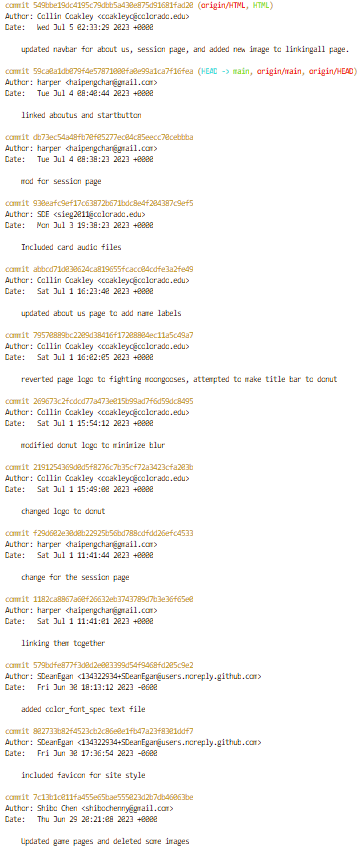

# Weekly Status - Status Update as of 7/4/2023

## Trello Screenshot

## Git log

## Narrative

This week, Team 5 has been creating additional HTML files to navigate our site's pages, which include an About Us, Session Page, and Home Page, primarily. We are linking our pages and trying to make uniform layouts and navigation bars to give a clean look and feel to our HTML files.

In addition to the specific tasks listed in the Trello "Doing" tab, members of Team 5 are currently:
* learning JavaScript so we can begin programming our game logic for future integration into the website. 
* Working to identify the best tools to use to facilitate multiplayer gaming for our game that supports 2-4 players. We are currently weighing the pros and cons of two companies: PubNub and Ably. 
* Using branches to make modifications to files in the GitHub repo