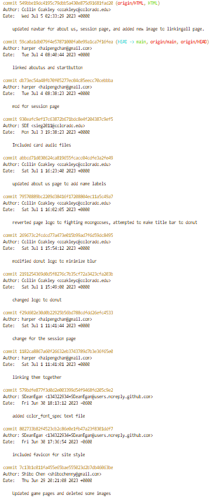

# Weekly Status - Status Update as of 7/4/2023

## Trello Screenshot

## Git log

## Narrative

This week, Team 5 has been creating additional HTML files to navigate our site's pages, which include an About Us, Session Page, and Home Page, primarily. We are linking our pages and trying to make uniform layouts and navigation bars to give a clean look and feel to our HTML files.

In addition to the specific tasks listed in the Trello "Doing" tab, members of Team 5 are currently:
* learning JavaScript so we can begin programming our game logic for future integration into the website. 
* Working to identify the best tools to use to facilitate multiplayer gaming for our game that supports 2-4 players. We are currently weighing the pros and cons of two companies: PubNub and Ably. 
* Using branches to make modifications to files in the GitHub repo
* Members of Team 5 are working making a first sweep at the game logic while the rest of the team learns enough JavaScript to provide assistance in that regard.

## Individual Updates

Harper Chen

This week, I developed key sections of our project, starting with the 'About Us' page which involved creating an HTML layout and integrating CSS design. Additionally, I crafted the game session page, an essential interface featuring game status, player details, and interactive elements. I also implemented the 'Start' button, a functional feature initiating the game and providing a user-friendly interface. These tasks were complemented by my collaborative efforts with the team, involving component reviews and problem-solving sessions.

Next Steps
Moving forward, our focus will be on developing more game features, testing and debugging current functionality, and preparing project documentation and presentation. This proactive approach will keep us on track and ensure the seamless operation of our game.

 

Shibo Chen

In my role, I successfully developed our responsive game page tailored for 2 - 4 players using HTML and CSS, ensuring a good user experience. Meanwhile, I attempted to employ Python, Flask, and Flask-SocketIO to implement our game logic. This combination of technologies allowed us to build a robust back-end that efficiently handled game mechanics, player actions and etc. The use of Flask-SocketIO enabled smooth and seamless communication between the server and clients, providing a good gaming experience. My next objectives include advancing the game logic, designing an efficient SQL database to store essential game data, and creating a suite of tests to verify that our game and database operations are working correctly. 

 

S Dean Egan

I have been introducing game asset files and images to be used on our webpages. This has included a 'flyer' which I have used to promote a theme to be used for our website and game, and is featured on the site landing page. As well as the images used for the playing cards, sound effects, and a background within the game. I've also been researching javascipt and existing web apis for multiplayer functionality, to better serve the project. Coming up, I'll expand the project trello board, and try to make some more audio and image files to be used within the game as well.

 

Collin Coakley

For my contribution, I added some features to the HTML for our site, including linking pages and updating the navigation bar. I also began researching the pros/cons of Ably and PubNub to see which would be better for our project to enable multiplier functionality of our game. I began learning JavaScript and creating pseudocode for the JavaScript implementation of the game logic for our project. Next week, I plan on continuing to learn JavaScript, add content and formatting to our HTML pages, and work on the next project milestone.

 

Roman Di Domizio

I had spent a good chunk of my time learning HTML, CSS, and JavaScript. Then I begun adding to the session listings page and started trying to figure out how to set up the game logic.

 